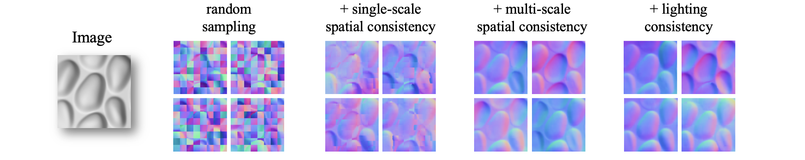

# Multistable Shape from Shading Emerges from Patch Diffusion

**NeurIPS 2024 (Spotlight)** ✨ [**arXiv**](https://arxiv.org/abs/2405.14530) | [**Project Page**](https://vision.ist.i.kyoto-u.ac.jp/research/mssfs/) 

[Xinran Nicole Han](https://xrhan.github.io/), [Todd Zickler](https://www.eecs.harvard.edu/~zickler/), [Ko Nishino](https://vision.ist.i.kyoto-u.ac.jp/) <br>

## 🧐 Introduction
We present a bottom-up, patch-based diffusion model for monocular shape from shading that produces multimodal outputs, similar to multistable perception in humans.



[//]: # (### Abstract)
> Models for inferring monocular shape of surfaces with diffuse reflection -- shape from shading -- ought to produce distributions of outputs, because there are fundamental mathematical ambiguities of both continuous (e.g., bas-relief) and discrete (e.g., convex/concave) types that are also experienced by humans. Yet, the outputs of current models are limited to point estimates or tight distributions around single modes, which prevent them from capturing these effects. We introduce a model that reconstructs a multimodal distribution of shapes from a single shading image, which aligns with the human experience of multistable perception. We train a small denoising diffusion process to generate surface normal fields from 16×16 patches of synthetic images of everyday 3D objects. We deploy this model patch-wise at multiple scales, with guidance from inter-patch shape consistency constraints. Despite its relatively small parameter count and predominantly bottom-up structure, we show that multistable shape explanations emerge from this model for ambiguous test images that humans experience as being multistable. At the same time, the model produces veridical shape estimates for object-like images that include distinctive occluding contours and appear less ambiguous. This may inspire new architectures for stochastic 3D shape perception that are more efficient and better aligned with human experience.

## 👻 Usage
We provide two ways to interact with the codebase. Given that our model is compute-efficient, a single GPU suffices for both training and inferece.

We provide our pre-trained model (with data augmentation) in the `saved_models/` folder. The file `render_diffuse.py` contains code to generate synthetic Lambertian image data from ground truth surface normal maps. 

### Getting started
First, clone our repository
```
git clone https://github.com/xrhan/mssfs.git
cd mssfs
```
The training code is contained in `model_train.py` and the guided sampling code is in `multiscale.py`. The spatial consistency loss functions are implemented in `ddim.py` and the lighting consistency guidance functions are in `lighting.py`.

We provide four test images in `test_data/` to reproduce the results in Figure. 5 of our paper.


Our default scheduler employs a V-cycle (fine-coarse-fine) and produces outputs at resolution 160 by 160 pixels. You can specify the random seeds, test images and test model in the main function of `multiscale.py`.

### Option 1. Running on Colab
Make sure you have a GPU runtime on Colab. Install essential packages with
```
!pip install -q -U einops datasets tqdm
```
To generate surface normal predictions on the 4 default test images (with 4 random seeds each), simply run
```
!python3 multiscale.py --files 0 --model 1 --save-name test&
```
You will find the generated results (in both image plot and raw pickle file) in the `eval/` folder. The plot shows the denoising process across multiple scales and a final result.

### Option 2. Installation on server


## 🍵 Analyze the results
The file `post_process.py` contains some functions to analyze the sample distributions. For instance, computing the Wasserstein distance between distributions or projecting the samples to lower dimensions using tSNE.

## 🎓 Citation

If you find our work useful, please consider citing:

```bibtex
@article{han2024multistable,
  title={Multistable Shape from Shading Emerges from Patch Diffusion},
  author={Han, Xinran Nicole and Zickler, Todd and Nishino, Ko},
  journal={arXiv preprint arXiv:2405.14530},
  year={2024}
}
```

## 😺 Acknowledgement
Our synthetic dataset is generated from the ground truth shapes in [Universal Photometric Stereo Network using Global Lighting Contexts (CVPR2022)](https://github.com/satoshi-ikehata/Universal-PS-CVPR2022). We are also inspired by the implementation of diffusion models in [The Annotated Diffusion Model](https://huggingface.co/blog/annotated-diffusion) and the diffusion guidance in [SyncDiffusion: Coherent Montage via Synchronized Joint Diffusions (NeurIPS 2023)](https://github.com/KAIST-Geometric-AI-Group/SyncDiffusion).